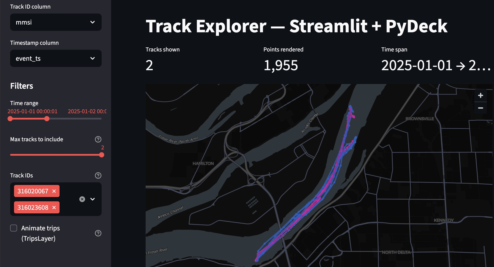

# knot-another-pipeline
Experiments identifying patterns in AIS activity using reproducible IaC and data pipelines.

# Summary and Project Goals

This project demonstrates best practices for building reusable, scalable data pipelines, infrastructure as code, and lightweight analytics applications that surface new insights from complex maritime data.

One core objective is to uncover coordinated vessel movement (e.g., shared fishing fleets or ships that frequently travel in tandem). The example below shows two ships traveling together in the South Arm Fraser River near Vancouver on 1 January 2025 during preliminary exploration. The image was generated from the silver-layer dataset using the Geo-Temporal Data Explorer app.



 The AIS data from January 2025 includes 215 million individual rows. Batch processing that data from silver to gold tables is completed in less than 30 minutes.

## Data

This project relies on the publicly available [NOAA Marine Cadastre Vessel Traffic Data](https://hub.marinecadastre.gov/pages/vesseltraffic) site.

## Apps
### Geo-Temporal Data Explorer
Built using Streamlit and PyDeck, this application lets analysts load a CSV file, visualize vessel tracks on an interactive map, adjust a time slider, and select specific track IDs or UIDs. Launch instructions and Streamlit configuration live in the `apps` directory. Generate CSV extracts for the app with:

```bash
python apps/export_tracks_to_explore.py \
  --start 2025-01-01 \
  --stop  2025-01-03T12:00:00 \
  --mmsi <mmsi1> <mmsi2> ... \
  --staging-dir s3://knap-ais/athena-results/ \
  --region us-east-1
```

The script queries Athena for the requested MMSIs/time window and writes results under `data/interim/tracks_to_explore/`.

Launch the Streamlit app locally with:

```bash
conda activate knap
streamlit run apps/track_explorer.py
```

Streamlit prints a local URL (default http://localhost:8501) after it starts.

## Getting Started

Before you begin, configure AWS credentials (environment variables or `AWS_PROFILE`) and install Terraform ≥ 1.6, the AWS CLI, and Conda.

1. **Create the Python environment**
   ```bash
   conda env update --file apps/environment.yml --prune
   conda activate knap
   ```

2. **Provision infrastructure (S3 bucket and Glue catalog)**
   ```bash
   cd infra/terraform/ais_bucket
   terraform init
   terraform apply

   cd ../ais_glue_catalog
   terraform init
   terraform apply
   ```
   The Terraform variables file (`terraform.tfvars`) lets you set the bucket name, region, and tags. See `docs/terraform_setup.md` for a full walkthrough and example values.

3. **Ingest NOAA data to bronze and silver**
   ```bash
   cd ../../..
   python pipelines/ais_pipeline.py run \
     --bucket knap-ais \
     --region us-east-1 \
     --start-date 2025-01-01 \
     --end-date 2025-01-31 \
     --create-bucket
   ```
   Adjust the date window to match the archives you want to load.

4. **Refresh the Glue catalog**
   ```bash
   aws glue start-crawler --name knap-ais-silver
   aws glue get-crawler --name knap-ais-silver --query 'Crawler.State'
   ```
   Wait until the crawler reports `READY`; the `silver_ais` table will then be visible in Athena.

5. **Build gold tables in Athena**
   ```bash
   python pipelines/refresh_gold_tables.py \
     --start-date 2025-01-01 \
     --end-date 2025-01-31 \
     --region us-east-1 \
     --athena-output s3://knap-ais/athena-results/ \
     --gold-root s3://knap-ais/gold \
     --mode replace
   ```
   Use `--mode append` for incremental refreshes.

6. **Verify the results**
   ```bash
   aws s3 ls s3://knap-ais/bronze/ais/year=2025/month=01/day=01/
   aws s3 ls s3://knap-ais/silver/ais/year=2025/month=01/day=01/
   aws s3 ls s3://knap-ais/gold/ --recursive | head
   ```
   Review `docs/data_contracts.md` for schema expectations and consult `docs/ais_pipeline.md` for deeper pipeline details. Track outstanding tasks in `TODO.md`.

7. **Export tracks for the Geo-Temporal Data Explorer (optional)**
   ```bash
   python apps/export_tracks_to_explore.py \
     --start 2025-01-01 \
     --stop 2025-01-03T12:00:00 \
     --mmsi <mmsi1> <mmsi2> ... \
     --staging-dir s3://knap-ais/athena-results/ \
     --region us-east-1
   ```
   The script writes CSV files to `data/interim/tracks_to_explore/` for use in the Streamlit app. Provide at least one MMSI and ensure the staging directory matches your Athena results bucket.

## Pipelines
### Bronze → Silver Pipeline

The bronze/silver pipeline ingests daily NOAA archives and standardises them for downstream analytics:

- **Bronze layer**: NOAA AIS archives (`.zip` / `.csv.zst`) are stored raw in S3 under `bronze/ais/year=YYYY/month=MM/day=DD/`, preserving the original filenames for lineage.
- **Silver layer**: The pipeline streams each daily archive, normalises timestamps, enriches metadata (`source_url`, `ingested_at`), and writes partitioned Parquet files bucketed by MMSI to `silver/ais/year=YYYY/month=MM/day=DD/bucket_id=##/`.

Other features of the pipeline include:
- **Deduplication**: Silver writes are append-only to support incremental loads; reprocessing the same day creates additional Parquet files, so downstream consumers should drop existing partitions or dedupe by `ingested_at`/`source_file`.
- **Resiliency**: Downloads show progress bars, bronze uploads are skipped if the object already exists, and silver writes retry throttled S3 requests with exponential backoff before surfacing errors.
- **Configuration**: The CLI (`pipelines/ais_pipeline.py`) exposes flags for date windows, partitioning knobs, bucket creation, and dry-run planning so the same script can power orchestration jobs or ad-hoc pulls.

### Gold Layer Pipeline
The gold layer currently includes two tables:

- **`sql/gold/create_uid_hourly_h3.sql`** distills billions of unique geospatial points into averaged hourly geospatial per ship. It cleans up the messy NOAA timestamps with a tiered `TRY_CAST`/ISO normaliser and writes the summary bucketed by hashed `mmsi` while partitioning by `dt/hour`. To make comparison of trajectories easier, the pipeline calls an H3 Lambda UDF on the averaged latitude/longitude for every vessel-hour—so downstream joins snap to hexagons instead of compute intensive distance calculations. 

- **`sql/gold/create_pairs_daily.sql`** builds on that curated dataset to surface daily co-movement pairs. It joins the hourly table to itself on matching `dt`, `hour`, and `h3_index`, enforcing `a.mmsi < b.mmsi` to prevent symmetric duplicates while still letting the planner prune partitions. The script then projects hyper-local overlap metrics (`hT` for hours together and `gT` for geohashes together) plus two Jaccard similarity scores for temporal and spatial agreement, finally averaging them into a Geo-Temporal Jaccard (`gtj`) score.


- The design contract for the hourly H3 mart lives in `docs/data_contracts.md` (`gold/uid_hourly_h3`) and now includes a companion pairs table fed from the hourly output.
- Use `pipelines/refresh_gold_tables.py` to (re)build the gold layer straight from Athena. The script:
  1. Accepts `--start-date/--end-date` and walks the window one day at a time so each CTAS hits a single silver partition.
  2. Supports `--mode replace` (default) to drop existing tables, clear the gold S3 prefixes, and rebuild everything, or `--mode append` to add only the new day partitions.
  3. Issues per-day CTAS jobs into temporary tables, drops them after the parquet files land in the correct `dt=`/`year=` prefixes, then recreates the permanent external tables and runs `MSCK REPAIR TABLE`.
  4. Runs data-quality checks that compare the sum of `message_count`/`source_row_count` in `uid_hourly_h3` to the filtered silver row count, logging any deltas.
  
  Example invocation:
  ```bash
  python pipelines/refresh_gold_tables.py \
    --start-date 2025-01-01 \
    --end-date 2025-01-31 \
    --athena-output s3://knap-ais/athena-results/ \
    --mode replace
  ```
-  The script assumes the H3 Lambda UDF is deployed and that the AWS CLI can reach the bucket for the optional cleanup steps.
- An Athena CTAS template is still provided at `sql/gold/create_uid_hourly_h3.sql` for quick experimentation or bespoke backfills; update the date filters before running it by hand.
- Future orchestration can wrap the refresh script or wire it into Step Functions/Airflow once the daily cadence is nailed down.
- To pull silver-layer track points for one or more MMSIs over a time window, use Athena/Trino queries based on the SQL templates under `sql/`. Export subsets as CSV for the Geo‑Temporal Data Explorer when needed.

## Analysis

### Co-Movement Identification
Identifying ships that travel together over extended windows is central to understanding bottlenecks, shadow fleets, and coordinated patterns such as fishing operations. Naively looking for “similar trajectories” scales poorly, so the repo relies on the two gold tables described above.

Together these scripts turn raw AIS data into an hour-by-hour hex grid and then into statistically defensible co-travel signals for further exploration by the Geo-Temporal Data Explorer app. It’s a compact, AWS-native workflow that leverages Athena’s strengths by pushing the heavy lifting into pre-aggregated gold tables, keeps everything partition-aware, and lets analysts focus on stories hiding in high `gtj` pairs.
